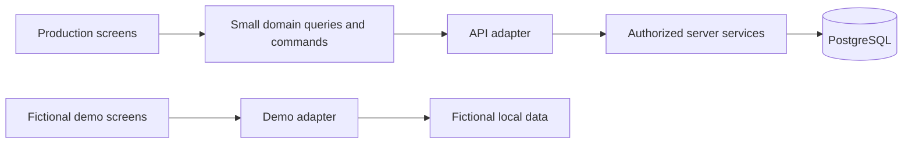

# Frontend migration contract — Issue 7

[Transition guide](../PROTOTYPE_TO_PRODUCTION.md) · [Complete inventory](prototype-migration-inventory.md) · [Domain](domain-contract.md) · [Authorization](authorization-contract.md) · [API](api-contract.md) · [Replay](idempotency-contract.md)

## Purpose and authority

**Prototype v0 — completed before production milestones.** Keep its useful booking,
parcel, receipt and messaging experience while changing the source of business truth.
This planning issue specifies the migration and its verification. It does not implement
adapters, authentication, endpoints, database imports, domain extraction or UI changes.

Baseline: main `36ce6d3`, including merged Issues #2/#3/#4/#5/#6 (PRs #85–#89).
ADRs 0001–0008 and the canonical domain/lifecycle/authorization/API contracts govern this
plan. Historical prototype comments, tests, local SQL drafts and generated planning packs
are evidence, not authority. Issue #7 refines the already accepted migration boundary;
no new framework, vendor or architectural replacement requires another ADR here.

Accepted rules include one Booking with one or more Parcels, globally unique parcel dockets,
private franchise customers, explicit custody distinct from ownership, seven non-inheriting
roles, integer paise and approved final rounding, UTC instants and Kolkata business dates.
Two physical attempts and the approved office-collection lifecycle supersede prototype
three-attempt/72-hour behavior. OTP counters are separate. Money, delivery and message
delivery are independent facts. Never alter these rules merely to keep an old test green.

## Screens and implementation owners

| Current screen / entry | Cutover owner | Required backend and policy owners |
| --- | --- | --- |
| Launcher, AppProvider and business shell | #18, #17, #75 | #11, #13, #14, #15; demo isolation |
| New Booking and repeat customer fill | #33 | #19–#23, #29–#31; #8 approved pricing/tax |
| Packages and parcel details | #34; delivery actions #42/#43 | #23–#25, #29; proof must remain unavailable until #42 gates pass |
| Lots | #34 | #26; W04 membership versus W06 destructive removal |
| Dispatch Routes | #34 | #27/#28; messaging fanout #41 |
| Operational Dashboard | #34 | #23/#24/#27/#28/#29/#32; later reporting #61–#65 and handoff #50 |
| Automation Feed | #44 | #35–#41, #43; verified provider outcomes |
| Receipts | #33 | #30; immutable issued snapshot and authorized retrieval |
| E-way Bills | #34 | #32; official provenance/policy #8 and verification #67 |
| Reports, including report detail routes | #61–#67 | Respective authoritative ledger, tax, parcel and messaging facts |
| Settings | #66 | #17/#20/#21/#38; installation secrets #36 stay server-only |
| Customer WhatsApp simulation and bot | #18 demo isolation; #46–#52 production conversation flows | #37/#38/#39 and scoped tools; arbitrary persona selection has no production equivalent |

The machine-readable inventory captures every JSX Route, including nested report and
fallback routes. The screen rows include multiple exports in MiscPages, not just filenames.
Carrier manual/file capability remains a separate authorized workflow under #53–#60;
provider unavailability never authorizes browser fallback or fabricated carrier success.

## Indirect behavior and supporting files

| Evidence | Required migration treatment / owner |
| --- | --- |
| data/bot.ts ensureChat/pushChat and consent updates through aliases | #46/#47/#38 server context; fictional chat state remains demo-only |
| CustomerWhatsApp.tsx flush timer, visibility listener and delivered marker mutation | #44 verified provider records; viewing a simulated chat cannot prove real delivery |
| shippingco_current_phone and arbitrary phone persona | #18 demo-only identity selection; #46 verifies production identity |
| store.ts startup load, normalization, legacy copy, storage event and subscriber list | #18 isolate side effects; no production import/seeding or cross-session snapshots |
| MiscPages.tsx delayed markAllBizSeen | #44 scoped read-state operation; timer canceled on unmount/scope change; stale callbacks cannot mutate another scope |
| utils/receipt.ts print-root and cleanup timer | #30/#33 issued snapshot; purge private print content on logout/scope change |
| utils/image.ts and m3/Controls.tsx attachment previews | #31/#33 validated private attachment references; revoke temporary URLs and drop private previews |
| ReportsPage.tsx CSV Blob and object URL cleanup | #61 scoped filtered export, formula neutralization, cleanup; history/URLs cannot leak previous scope |
| data/types.ts and data/messages.ts | #3/#4 canonical public DTOs and #36/#40 approved message intent; do not export prototype OTP fields as shared types |
| test/setup.ts and direct test mutations | Keep isolated demo setup; #9 and feature owners create server fixtures instead of writing browser objects |

Support file fingerprints cover types, templates, image handling and attachment controls as
well as the transitive store consumers. Other timer/listener sites (dialogs, navigation,
snackbars and animations) are captured for review; preserve their accessibility/cleanup
behavior without treating presentation effects as business mutations.

## Small domain interfaces, implemented by Issue 18 and owners

Screens receive purpose-specific queries and commands: create a Booking, search permitted
customers, load a Parcel, record a route event, retrieve an issued receipt. They never receive
the whole Database, a generic save operation or arbitrary status setter. Interfaces are
asynchronous even in demo so loading/error behavior is testable. Exact feature DTOs remain
with their owners; reuse `/api/v1`, snake_case wire names, safe error codes, opaque cursors
and version/replay conventions from #4. DTO mapping is not authorization or business policy.

The adapter translates data/errors; the server owns price, permission, state, transaction
and proof. Use React/TypeScript and existing tooling. No microservices, ORM, broker, generic
repository abstraction, new state-management or feature-flag platform is introduced here.

Production composition must exclude demo storage initialization and mutation imports,
including transitive imports through formatting helpers. Merely hiding the reset button
does not satisfy isolation. Demo reset/seed/persona controls are a separate capability, absent
from production interfaces and builds. Configuration is selected once and validated; URL,
localStorage or a client feature flag cannot enable demo behavior in production. Environment
separation also requires #6/#68 identities and network access controls, not just bundling.

## Failure, retry and reload contract

| Situation | Required user-visible and data behavior |
| --- | --- |
| Initial loading | Show loading; do not seed fictional business rows or show unverified totals |
| Confirmed success | Show canonical saved result; refresh dependent lists from server; print only by explicit user action |
| Validation denial | Keep unsaved form in current session, show safe field errors; no local committed record |
| Timeout, disconnect, 500/503 | Outcome uncertain, not proof of rollback; preserve exact key/body/path/version and reconcile using the same command |
| 409 stale version | Fetch current authorized state; new deliberate action requires reviewed current intent; do not blindly overwrite |
| 409 in progress | Bounded retry of same intent, then explicit pending/reconciliation state |
| 401 | Stop private work, clear scoped data and require identity again; no automatic replay across another user |
| 403/404 | Safe denied/unavailable result; no fallback lookup or foreign-existence hint |
| API unavailable | No new local booking, payment, status or outbox write; retry is explicit/bounded |
| Provider unavailable after commit | Booking/ETA/payment remain saved; notification shows pending/failed/uncertain separately |
| Reload during uncertainty | Reconcile with the owner's authorized server workflow; do not mint a new command because the form was lost |

Issue #18 with #22/#24/#28/#29 must settle reload recovery before enabling each workflow.
Within a live session retain the exact pending intent. Persist only approved minimum recovery
metadata (opaque operation/key/reference/scope, no raw key in ordinary logs), subject to #6/#72
review. Do not persist OTPs, addresses or full command bodies as a shortcut. If the exact
intent cannot be safely reconstructed, use an authorized reconciliation path; do not submit
an incomplete body or promise a public key-lookup endpoint. After replay retention expires,
unresolved commands require reconciliation, never automatic fresh-key submission. Aborting
an HTTP request does not cancel a committed server command.

Saved facts and temporary UI state are different. An in-memory form/cache may help usability;
it is not a second business database or an offline-write product. No persistent production
draft containing private data is approved by this issue. Repeat customer fill remains optional
and must not overwrite deliberate user edits. A cached price suggestion is not a final quote.

## Scope changes and cache safety

Key private queries by authenticated session, organization, acting franchise, resource,
filters/cursor and applicable permission context. On logout, franchise change, revocation or
reassignment, clear affected caches, pending views, print roots, previews and object URLs.
Cancel outstanding requests and advance a scope generation. A late response from the previous
generation must be discarded even if transport cancellation failed. Do not resubmit a pending
command under the new scope; recovery requires the original authorized scope or explicit owner
reconciliation. Reauthorize on the server for every query, command and replay. Current session
revocation also needs a cross-tab invalidation strategy under #13/#18; no raw PII broadcast.

The org_admin receives only declared own-organization projections, not inherited operational
permissions. A1 staff cannot browse A2 customer history; custody grants only the required
shipment projection. Every role is denied B1 data from Org A. read_only never gains mutation
or export permission merely because a button is hidden. Exports, counts, receipts and attached
children must use the same scope rules as primary screens.

## Three concrete workflow traces

**Booking and printing:** NewBookingPage currently calls addBooking, which changes browser
state and queues a message; the success toast claims WhatsApp was sent. printReceipt looks
up mutable booking/business records and computes ETA using print time. Preserve optional
print and escaping, but use server Booking/Parcel results and an immutable issued receipt.
Issue #22 owns atomic creation; #30 owns issued receipt facts; #33 connects the whole journey.
Reprinting after a settings edit must not rewrite the original document.

**Route delay:** bookingsOfRoute deduplicates direct and lot membership, which should survive.
postRouteEvent currently adds delay hours and queues messages again on repeated calls; it
also infers route status from a title and excludes delivered but not RTO from delay updates.
For a fictional Parcel P at instant t, linked directly and through a lot, retrying one +4h
command must produce t+4h once, one committed cause and one logical notification intent.
Delivered/RTO parcels stay unchanged. A separately approved reminder can notify again but
cannot shift ETA. #28 handles bounded atomic operational effects; #41 handles resumable
post-commit notification fanout. Route membership is frozen for the command; concurrent
changes require version guards. This is not an exactly-once external delivery promise.

**Offline failure:** an unsent form may remain in memory, but no saved toast, receipt,
new docket or local list entry claims success before a server result. A timeout after commit
is reconciled with the same intent. Refresh cannot reseed or import browser JSON into a
production session. Tests must check stored server facts as well as visible messages.

## Migration waves and rollback

1. #18 implements boundary and demo isolation after its #11/#13/#15/#17 prerequisites.
2. #33 connects customer/booking/receipt workflows after their backend dependencies.
3. #34 connects parcel/lot/route/dashboard/e-way operations; delivery completion is gated
   until #42, as required by the pilot contract. Do not expose insecure placeholder proof.
4. #44 and #46–#52 connect provider evidence and verified customer workflows.
5. #61–#67 connect reconciled reporting and versioned settings.

Each wave has an owner, prerequisite evidence, compatible API/schema versions, behavior and
negative scope tests, and a removal checklist for old callers. Dependencies determine order;
this list is not permission to implement unavailable features. Enable a complete workflow
only when all reads/writes use the same authority. Related screens awaiting migration remain
unavailable in production. Never mix real records into a fictional page to make it appear ready.

Rollout: staging with fictional fixtures, reviewed pilot enablement, then broader supported
use. Future flags have an owner, tested on/off paths, server-controlled eligibility and removal
condition. Rollback disables the operation or restores a compatible API-backed version;
it never changes production to demo, drops committed data or reruns already completed commands.
Keep forward-only database compatibility and outstanding replay normalizers under #4/#10.
No live side-effect shadowing: comparison tests cannot double-book, charge or send messages.

## Import and retirement policy

No automatic production import from shippingco_v1, setu_courier_v2 or
shippingco_current_phone. Existing local drafts are neither accepted schemas nor production
records. Any future import needs a dedicated reviewed issue: operator authorization, dry run,
validation, ownership and sender/recipient mapping, provenance, conflicts, retention and
reconciliation. Do not delete a user's local data as part of migration planning.

Pure display helpers may remain after extraction. Demo implementation stays in its isolated
entry point. A production migration is complete only when direct/indirect store mutations,
initializers, data-URL persistence, timers and cache paths have an approved replacement or
are unreachable. Do not remove old demo regressions merely to get green tests.

## Evidence and limits

The [inventory](prototype-migration-inventory.md) links every exported symbol and Store member,
transitive caller, existing test declaration and twelve required walkthroughs to owners/rules.
The TypeScript compiler inventories imports, routes and test declarations (including parameter
tables). Fingerprints of coupled files catch changes in alias mutations, timers, callbacks and
test bodies. The scanner cannot prove arbitrary runtime data flow; manual review remains
required. Coverage refresh is a reviewed update to decisions, not an automatic approval.

The fixture contains expected fictional outcomes only. Its validator checks completeness,
drift, rules/owners and safety declarations, with deliberately broken controls. It does not
claim live authorization, SQL isolation, cryptography, browser cache or provider tests passed.
Those tests belong to #9/#18 and each implementation owner. Existing demo tests stay unchanged.

Run `pnpm check:planning` for all contracts and the new inventory check; run `pnpm quality`
for pinned toolchain, quality-gate tests, planning, lint, typecheck, application tests and build.
See [verification](prototype-migration-verification.md) for actual results and acceptance map.

## Research applied

- [Spotify migration guidance](https://engineering.atspotify.com/2022/11/strategies-and-tools-for-performing-migrations-on-platform): scoped migration map, ownership, small steps and automation.
- [Microsoft adapter guidance](https://learn.microsoft.com/en-us/azure/architecture/patterns/anti-corruption-layer): translation protects canonical domain meaning; it does not move business authority to the frontend.
- [Google behavior-focused testing](https://testing.googleblog.com/2013/08/testing-on-toilet-test-behavior-not.html): assert user/business outcomes rather than internal helper calls.
- [GitHub controlled rollout](https://github.blog/engineering/infrastructure/ship-code-faster-safer-feature-flags/): small changes, tested flag paths and rapid rollback, adapted here to prohibit demo fallback.

These principles fit the accepted modular monolith. No cloud platform, extra service or
company-scale migration infrastructure is selected by citing them.
