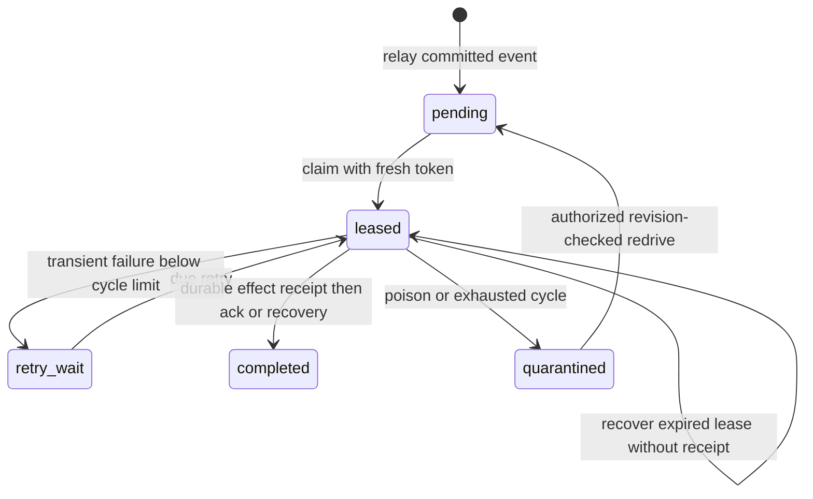

# Durable outbox operations

Issue #35 implements [ADR 0023](../adr/0023-durable-outbox-worker.md) under the
[event contract](event-contract.md). Producers continue committing their original
immutable facts with their business transaction. The worker relays references into
jobs keyed by event and consumer, with no payload copy or provider call.

The database effect and receipt share one transaction; acknowledgement uses a later
transaction. Recovery checks the receipt before permitting another effect.

## Execution and ownership

`apps/api/src/modules/outbox/consumers.ts` is the code-owned registry. It is empty
until downstream owners add reviewed handlers (#39/#40/#55/#58). Starting an empty
registry is safe and idle; it does not acknowledge undispatched producer events.
Registration IDs are durable protocol identities, not deployment/version strings.
Changing an ID replays all subscribed history and requires explicit owner review.
Removing a consumer pauses its jobs; restore the same ID to resume them.

A consumer declares exact event types/schema versions, payload validation and an
M/P/H/R ordering policy. It receives a trusted single-franchise capability and a
validated source event. Its database writes use scoped SQL in the supplied transaction.
The handler cannot commit independently or send network traffic. Never bypass scope,
launch detached writes or use a second pool. Registering a subscription also requires
testing its historical events and domain-specific gap reconciliation. A generic `true`
gap callback is appropriate only in the synthetic history fixture, not in production.

Five claims per cycle, a 30-second lease, 1–30-second jittered exponential retry,
100-event relay batches and a one-second poll bound work. Production lease timestamps
come from PostgreSQL; an injected clock exists solely for deterministic tests. Effect
transactions have a 25-second PostgreSQL transaction deadline; process pool statements
and idle transactions also have deadlines. Database-only callbacks must remain bounded.
Job locks and lease tokens fence stale writers. Effect and receipt commit together;
acknowledgement can then be retried without repeating effects. A lost database COMMIT
response is reconciled using that receipt. This does not guarantee remote exactly-once delivery.

Separate persisted relay, claim and quarantine-alert turns rotate eligible franchises.
With N continuously eligible franchises and bounded transactions, each gets a turn
within N successful selections. A busy selector yields until the next poll. This is
fairness between franchises per consumer, not global FIFO or a throughput SLO.

## API and permissions

All routes require an authenticated session and explicit `organization_id` and
`franchise_id` query selectors. R18 permits org_admin reads in its organization and
franchise_admin reads in its explicit grants; all other roles are denied. W44 permits
redrive only to a currently authorized franchise_admin with active roots. W34 arbitrary
redrive remains denied. Current membership is rechecked on retries and cursor use.

| Route | Result |
| --- | --- |
| `GET /api/v1/outbox/health` | State counts, oldest age in seconds, recovery owner and runbook |
| `GET /api/v1/outbox/jobs` | Minimized jobs; optional limit 1–100 (default 50), opaque cursor |
| `GET /api/v1/outbox/jobs/:job_id` | Minimized job, latest 100 attempt records, history_truncated |
| `POST /api/v1/outbox/jobs/:job_id/redrive` | Original `{id,version,state:"pending"}` receipt |

Redrive requires normal CSRF/origin checks and `Idempotency-Key`. The strict JSON body is
`{"expected_version":7,"reason_code":"dependency_repaired"}`. Other permitted reasons
are `consumer_upgraded` and `ordering_reconciled`. No free text or ownership fields.
The example revision is illustrative: obtain the current revision from job detail.
Same actor/scope/key/intent returns the original receipt even if processing has since
advanced; changed intent yields `IDEMPOTENCY_CONFLICT`. Only a quarantined job with the
expected revision can transition; otherwise `VERSION_CONFLICT`. Live authorization
precedes replay. Redrive preserves job/event/consumer identity and total attempts, resets
only the bounded cycle and creates immutable canonical audit evidence.

Foreign/unknown IDs return the same `RESOURCE_NOT_FOUND`; invalid bodies/selectors return
`VALIDATION_FAILED`; invalid or scope-mismatched cursors return `CURSOR_INVALID`. API
responses never contain event envelopes, lease tokens or raw exceptions. Audit describes
the actor, scoped job, correlation, revision and closed reason, not customer payloads.

## Runbook: outbox-quarantine-v1

1. Inspect authorized health and job detail. `outbox_quarantined` plus
   `MANUAL_REVIEW_REQUIRED` is the safe process signal; stored quarantine remains
   alertable after restart, even without runnable jobs. No external alert is sent here.
2. The franchise admin coordinates with the consumer owner. Repair the indicated schema,
   ordering, integrity or dependency failure first. Do not edit the source or delete receipts.
3. Read the current job revision and redrive once using a new intent key and accurate
   closed reason. Reuse that key if the response is lost. A 409 requires inspecting fresh
   state; repeated redrive without a repair can exhaust the next cycle again.
4. Verify completion and retained audit/history. If processing still fails, stop that
   consumer and repair forward. Do not re-register it under a new ID to bypass evidence.

Hosted delivery of alerts, dashboards and service identity composition belong to
#68/#70. For now process supervision can consume safe structured stderr codes and
operators use the scoped API. Quarantine remains visible until successfully redriven.

## Development, migration and rollout

Use the pinned toolchain in [quality checks](../QUALITY_CHECKS.md), Docker and a disposable
PostgreSQL 18.6 database. `pnpm db:local quality` runs the real producer, worker, HTTP and
upgrade fixtures without touching production. The fixture in
`apps/api/test/database/outbox.test.ts` creates fictional bookings/routes/payments and
synthetic consumers, stops at commit/ack boundaries, races workers and tests scoped
redrive. `packages/db/test/integration/outbox.test.ts` starts at the 21-migration baseline,
checks failed-upgrade rollback, then applies the 22nd migration and verifies no-op replay.

For a separately provisioned developer database, apply migrations with the migration
identity, grant the documented runtime privileges, export the usual API environment
from `.env.example`, then run `pnpm --filter @shippingco/api start:worker`. `.env` is not
loaded automatically. This entry point accepts only developer-local secret resolution;
hosted composition must inject a managed resolver into `startOutboxRuntime`. It requires
no messaging credentials. SIGINT/SIGTERM stops new claims and drains the current effect
before closing the pool. An empty registry performs no business work.

Migration `1790528400000-durable-outbox.cjs` is additive, with no backfill of jobs and no
producer rewrite. Composite owner foreign keys and unique identities protect links;
attempts, receipts and redrives are append-only. Grant runtime SELECT on operational
tables, SELECT/INSERT plus UPDATE(high_water) on streams, UPDATE(id) on jobs solely for
row locking (the trigger forbids identity mutation), and EXECUTE on the narrow definer
functions. `packages/db/test/support.ts:prepareOutbox` is the executable grant reference.
PUBLIC receives no function execution. Never grant direct job-state/history DML.

Deploy the schema first, then compatible API and worker code. Existing producer/API code
remains compatible during the window. The relay catches historical and late commits
without a fragile global watermark. Creating indexes and replacing the audit view may
briefly lock existing objects; schedule/measure migration on representative staging data
before production. Large-backlog qualification belongs to #74. Roll back by stopping the
worker and reverting compatible code; retain evidence and repair schema forward. Retention
and deletion are separately governed by #72. No production database was used for validation.
