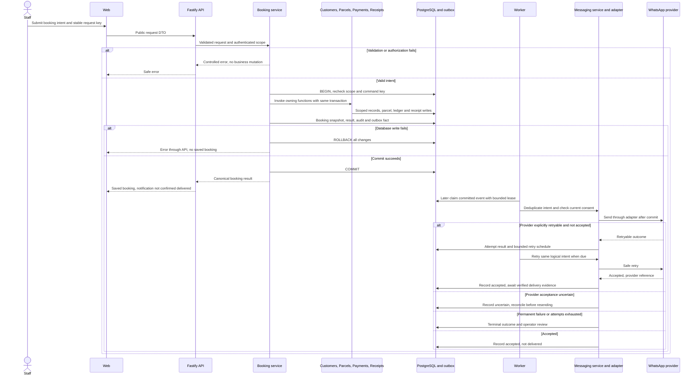
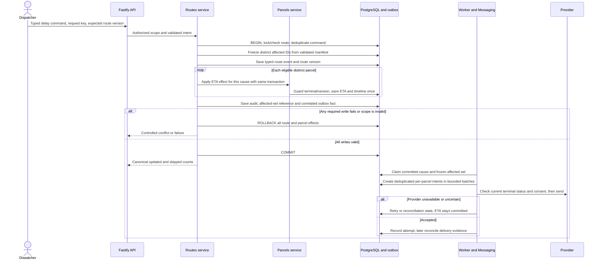
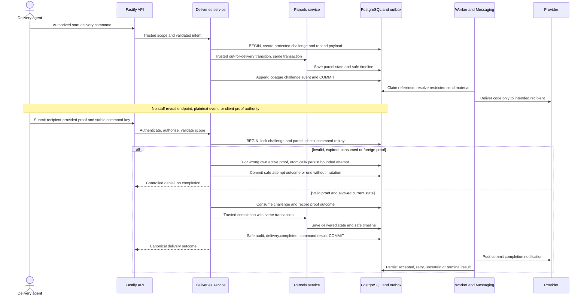
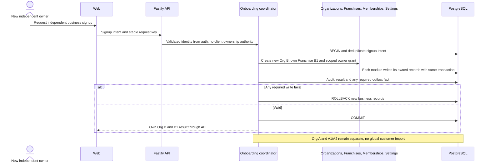

# Runtime sequences and authority walkthroughs

[Architecture index](README.md) · [Ownership](system-context.md) · [Outbox/contract ADR](../adr/0004-durable-events-and-transactional-outbox.md)

These are reviewable contracts for later implementation, not executed production traces.
Command/event names are conceptual; #4 owns the final versioned catalog. A transaction
uses one checked-out pg connection passed explicitly between owning module functions.
The coordinating application service commits once; callees cannot independently commit.
No HTTP response may imply provider delivery merely because the business transaction committed.

## A. Counter booking

| Step | Actor / command or event | Authoritative component | State read | State mutated | Transaction / durable fact | Failure behavior |
| --- | --- | --- | --- | --- | --- | --- |
| 1 | Staff submits create booking | Booking service, using auth/membership policy | Current identity, O/F grants, referenced resources, request fingerprint | None before validation | No business write yet | Deny or validation error; no browser fallback |
| 2 | Create/link customer if required | Customers service, called by Booking | Scoped customer match policy | Customer only if needed | Same booking transaction; owning fact if changed | Foreign reference/ambiguous match fails under D03 |
| 3 | Calculate and save booking | Booking service, using Pricing's approved calculation | Effective rates/settings, jurisdiction and command key | Booking/docket and immutable charges/tax snapshot | Same transaction; `booking.created` | Unknown jurisdiction or conflict does not silently select tax |
| 4 | Initialize parcel | Parcels service, called by Booking | Validated booking and #3 cardinality | Parcel initial lifecycle/ETA/timeline | Same transaction; correlated fact catalogued by #4 | No fabricated ETA; partial creation rolls back |
| 5 | Establish obligation/record actual Paid collection | Payments service, called by Booking | Gross snapshot and explicit collection intent | Obligation, append-only ledger entry when collected | Same transaction; payment fact when applicable | Duplicate key cannot double collect; To-Pay has no automatic collection |
| 6 | Capture issued receipt facts | Receipts service, called by Booking | Saved booking, business snapshot and payment facts | Immutable receipt snapshot | Same transaction | Snapshot failure rolls back issue of booking/receipt as a unit |
| 7 | Finalize result and business fact | Booking service coordinates; Audit owns append format; producer owns outbox fact | Transaction results | Idempotent result, safe audit and event | COMMIT all or ROLLBACK all | HTTP timeout after commit: same scoped key/fingerprint retrieves original result after current authorization |
| 8 | Consume booking fact | Outbox infrastructure owns lease; Messaging owns notification | Committed event, authorized recipient, consent/template | Lease, one logical intent, attempt/outcome | Later short transactions; no source-state mutation | Retry, skipped/blocked, uncertain or terminal remains visible |
| 9 | Provider callback | Messaging ingestion/reconciliation | Verified source and registered installation, prior attempt | Deduplicated callback and normalized delivery state | Callback persistence before acknowledgement | Forged callback rejected; duplicates/stale state cannot regress outcome |

Notification fanout can also receive correlated parcel events; #40 suppresses duplicate
same-purpose messages. Receipt printing remains an explicit user action. This diagram
names future M2 ownership even though the complete booking/ledger/receipt flow cannot
be reported ready until those dependent issues are merged. This does not add backwards
prerequisites to #22: #22 establishes booking/parcel snapshots, command receipt, event
record and initial obligation contract; #29/#30 later implement their owned ledger and
receipt functions and integrate them into this completed flow. Do not claim a Paid
collection or issued receipt before its owning implementation exists. A command receipt
for idempotency is distinct from a customer-facing issued receipt.

## B. Route delay

| Step | Actor / intent | Authoritative component | State read | State mutated | Transaction / durable event | Failure behavior |
| --- | --- | --- | --- | --- | --- | --- |
| 1 | Dispatcher delay intent | Routes service | Membership/action scope, route and manifest version | None until authorized | No side effect before validation | Reject foreign nested lot/parcel references |
| 2 | Accept typed cause | Routes service | Route state, unique command/cause | Route status/version, immutable typed event, distinct affected membership | One route transaction | Same cause replays original result; stale version conflicts; title never controls state |
| 3 | Propagate ETA effect | Parcels service, invoked by Routes | Locked parcel version, terminal status, existing ETA, prior cause application | Eligible parcel ETA/timeline and applied-cause identity | Same transaction, correlated parcel fact if #4 catalogs it | Each parcel once despite lot/direct overlap; delivered/RTO skipped; missing ETA remains explicitly unavailable |
| 4 | Publish committed route fact | Routes service; Audit append; outbox persistence | All application results | Counts, audit, `route.delayed` with frozen membership reference | Commit with all preceding writes | Any required write failure rolls back every effect |
| 5 | Fanout/reminder | Messaging service under #40/#41 | Committed affected set, current terminal status/consent, cause/purpose identity | Notification intents and per-item progress | Post-commit transactions | Partial batch retry schedules unfinished intents only; never modifies ETA |
| 6 | Provider processing | Messaging service/adapter | Intent, installation, prior attempt | Attempt/reconciliation state only | After commit | Uncertain acceptance is not blindly retried; safe manual action is audited |

Initial consistency choice: bounded route commands apply all eligible operational effects
atomically; oversized commands reject before mutation rather than partially applying.
D11 assigns the size/locking bound to #28 and qualification to #74. A future resumable
operational strategy needs an explicit reviewed contract revision. Notification fanout
is separately resumable and bounded under #41. Reminders have their own authorized,
rate-limited intent identity and cannot repeat the original ETA change.

## C. Delivery proof and completion

| Step | Actor / intent | Authoritative component | State read | State mutated | Transaction / durable event | Failure behavior |
| --- | --- | --- | --- | --- | --- | --- |
| 1 | Start delivery | Deliveries service | Scope, parcel eligibility, existing challenge | Challenge verifier and encrypted short-lived resend material | Shared delivery transaction; opaque event reference | D07 defines expiry/attempt/cooldown; ordinary resend cannot reset counters |
| 2 | Enter out-for-delivery | Parcels service only through trusted Deliveries call | Current parcel state/version | Parcel state and timeline | Same transaction as challenge | Generic API status path denied; DB failure rolls back both |
| 3 | Send challenge | Restricted delivery/messaging path | Active reference, intended recipient, send policy | Notification and provider attempt | Post-commit only | Failure visible; approved resend/exception policy, no reveal bypass |
| 4 | Verify proof | Deliveries service exclusively | Current membership, scoped active challenge, keyed verifier, expiry/attempts, parcel state, idempotent result | Wrong-attempt counter or challenge consumption/proof outcome | Wrong attempts commit atomically without completion; success shares completion transaction | Foreign/expired proof denied; replay after reauthorization returns prior result; concurrent submissions produce one completion |
| 5 | Persist completion | Parcels service only through trusted Deliveries call | Validated in-transaction proof and current parcel version | Delivered state/time and safe timeline | Same transaction as consumed challenge | Any failure rolls back challenge consumption and completion together |
| 6 | Publish delivery outcome | Deliveries service coordinates; Audit appends | Proof outcome and parcel result | Safe audit, command result, `delivery.completed` | Same COMMIT | No free-standing client call can claim prior verification |
| 7 | Tell customer | Messaging service | Committed delivery fact/current policy | Intent and attempt only | Post-commit | Outage cannot undo delivery or mark payment collected |

The Deliveries service is the sole authority to approve completion; Parcels owns the
persistence of parcel lifecycle and accepts that transition only through its internal
trusted delivery entry point. This is one transaction, not two independently callable
public steps. Failed-attempt/RTO lifecycle policy is owned by Parcels (#24), with delivery
challenge invalidation coordinated through Deliveries where necessary. Exact transitions
and roles are D01/D02. Payment collection always requires Payments' separate authorized,
idempotent command; delivery alone leaves To-Pay outstanding. Exceptional proof requires
approved role, reason, evidence and audit and is labelled exceptional, never OTP-verified.

## D. Independent franchise onboarding

#17's onboarding coordinator owns the transaction/result; Organizations owns Org B,
Franchises owns B1, Memberships owns the explicit owner grant, Settings owns defaults,
and Audit owns safe append formatting. Auth (#13) proves identity but does not grant
business scope on its own. Concurrent/retried signup produces one authorized organization
result for the same intent. Onboarding never requires a national carrier to join first.

## Provider unavailable: tabletop acceptance scenario

1. For Org A/A1, submit a valid local booking while the carrier API is unavailable.
   Booking and its owning modules commit the local booking, ledger/receipt facts and
   outbox. Carrier acceptance remains separate and unconfirmed. #53 requires the
   manual adapter to remain valid even when all network capabilities are false.
2. The worker records a retryable not-accepted failure with attempt count, next eligible
   time and safe reason; exhausted or permanent/auth failures require operator action.
   If acceptance is uncertain, reconcile by provider reference/idempotency support or
   escalate for review before resending. A lease alone cannot prevent an external duplicate.
3. #54/#55 supply authorized manual reference entry and validated file import with scope,
   provenance and audit. They do not claim a live booking API succeeded. #56/#57 research
   access; #60 demonstrates the verified capability and labels manual/file-only outcomes.
4. WhatsApp independently failing leaves notification pending/failed/uncertain in #44's
   operator feed. #39/#41 supply bounded retry and deliberate reminder/reconciliation
   actions. No fallback edits the browser store, bypasses consent, reveals a code, or calls
   providers directly from web. Alternate delivery proof remains subject to #8/#42 policy.
5. Replay the command and event: command result stays singular; consumer/purpose/recipient
   identity deduplicates intents; attempts preserve logical identity. Confirm the ledger,
   booking and ETA never change merely because delivery of a notification failed.
