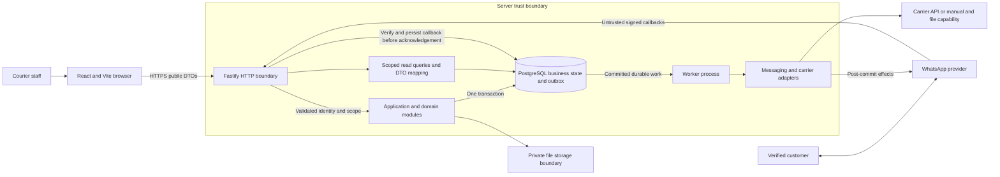

# System context, ownership and trust

[Architecture index](README.md) · [ADRs](../adr/README.md) · [Open decisions](open-decisions.md)

Everything below is the planned production design. Module names describe in-process
ownership; they do not imply separately deployed services or existing implementation.

## Context and containers

Customers interact through verified channel identity, not the demo phone selector.
Carrier observations enter through verified adapters and reconciliation; they do not
have generic delivery/payment write authority. File storage is a required private
boundary, with product/vendor selection deferred to D09. It is not provisioned here.

## Repository placement and dependency direction

| Component / planned location | Responsibility | Must not own |
| --- | --- | --- |
| Existing `apps/web` | UI, accessibility, client state, public DTOs, presentation validation and API calls | Authorization, final price/tax, business state, proof verification, provider credentials or durable effects |
| `apps/api/src/index.ts`, proposed `server.ts` / `env.ts` | Boot/shutdown; separately construct testable Fastify server; validate runtime configuration once | Feature rules or scattered reads of environment variables |
| Existing `apps/api/src/plugins/` | HTTP authentication, error mapping, request context and DB access | Implicit global tenant scope or business mutations |
| `apps/api/src/modules/<domain>/routes.ts` | Parse/validate public request, derive trusted context, invoke service/query, map public response | Business SQL transactions embedded in route handlers |
| `modules/<domain>/service.ts` | Authorize intent, coordinate one connection/transaction, call domain rules and owning module functions | HTTP objects or direct provider calls within a business transaction |
| `modules/<domain>/queries.ts` | Parameterized, scoped reads and internal write SQL helpers with explicit transaction input | Independent commits, business policy decisions or permission inferred from client filters |
| Pure domain functions inside their module | State-transition preconditions and deterministic calculations | I/O or secret-bearing exports to the browser |
| Existing `packages/db` | Pool, transaction primitive, row types and forward migrations; no Fastify boot needed | Business policy or a browser import surface |
| Proposed `apps/api/src/worker.ts` | Separate process/composition root for durable work and server-owned consumers | HTTP listening or unscoped cross-tenant scanning on behalf of a user |
| Proposed `modules/messaging` and `modules/carriers` ports/adapters | Application contracts, provider translation, normalized outcomes | Provider SDK types as domain contracts; authoritative delivered/paid writes |
| Existing `packages/shared` | Browser-safe DTOs/enums and deterministic, non-secret functions | Row entities, OTP/verifier, credentials, private events or authorization depending on membership/server state |

Imports point from HTTP/worker composition into application modules and their explicit
interfaces; modules use DB primitives. Web imports only the public shared surface.
Queries and commands share PostgreSQL: no separate CQRS infrastructure or replicated
read database is implied. DTO mapping sits at the service/query boundary and excludes
internal fields before HTTP serialization. Public shared rules may aid presentation;
the server still validates current state and permissions itself.

## Business data ownership

All authoritative records below persist in PostgreSQL (PG); attachment bytes alone
live in private file storage. Names are conceptual relationships, not final table or
column definitions. `O/F` means owning organization plus franchise; parents must agree
on both. `O` is organization scope; a user identity has no business scope until a
membership grants it. Each row has one mutation owner. Other modules call that owner
with a shared transaction; they never write its records directly.

| Concept | Authoritative module / mutation owner | Persistence and tenant path | Read owner / public versus internal | Downstream effects |
| --- | --- | --- | --- | --- |
| Organization | `organizations` | PG; O itself | organizations; approved profile only | Audit, onboarding result |
| Franchise/location | `franchises` | PG; belongs to O | franchises; scoped profile, no private sibling records | Audit, settings initialization |
| User/session | `auth` | PG identity/session; no implicit O/F access | auth; safe self profile, never credential/session secrets | Session revocation |
| Staff membership/invitation | `memberships` | PG; identity → O → explicit F/action grants | memberships; permission-limited staff DTO | Audit, invitation/revocation work |
| Customer | `customers` | PG; O/F, no global phone directory | customers; minimum allowed contact fields | Consent linkage; no automatic sharing |
| Booking and charge snapshot | `bookings` | PG; O/F → customer and parcel references | bookings; public booking DTO excludes internal keys/policy metadata | `booking.created`, receipt, payment obligation |
| Parcel, lifecycle, ETA and timeline | `parcels` | PG; O/F → booking | parcels; customer-safe timeline differs from staff projection | Lifecycle/ETA events; trusted delivery command required for completion |
| Manifest/lot and lot membership | `lots` | PG; O/F and scoped parcel relationships | lots; scoped membership projection | Route manifest reads, audit |
| Route and route manifest | `routes` | PG; O/F and validated lots/direct parcels | routes; scoped operational DTO | Typed route events |
| Route event/delay application | `routes` | PG; owning route, frozen affected membership and cause identity | routes; safe event/updated/skipped counts | Calls parcels to change ETA; correlated notification work |
| Delivery challenge/proof/attempt | `deliveries` | PG; O/F → parcel; secret payload protected separately | deliveries; outcome/expiry only, never verifier/plaintext | Calls parcels for trusted completion, delivery events |
| Payment obligation/ledger entry | `payments` | PG; O/F → booking; append-only collections/reversals | payments; permitted gross/collected/outstanding DTO | Reconciliation; never implicit delivery |
| Receipt snapshot | `receipts` | PG; O/F → booking; immutable issued facts | receipts; authorized rendering distinct from DB record | Explicit print/download, no silent reissue |
| Attachment | `attachments` | PG metadata O/F → booking/proof; private bytes | attachments; authorized access, no public bucket/internal storage keys | Validation/quarantine and retention work |
| E-way record | `eway` | PG; O/F → booking; externally issued provenance | eway; scoped recorded facts | Compliance/reporting; no government issuance |
| Notification/consent | `messaging` | PG; O/F → authorized recipient/source fact | messaging; safe intent and send-policy outcome DTO | Adapter delivery work |
| Outbox event | Producing domain owns immutable fact; `outbox` infrastructure owns lease/processing metadata | PG in producer transaction; O/F copied from trusted source | outbox internal inspection; no raw public event dump | At-least-once consumers |
| Provider delivery attempt/callback receipt | `messaging` | PG; O/F → notification and registered installation | messaging; normalized status, no raw sensitive payload | Retry, reconciliation, manual review |
| Carrier observation/reference/rate import | `carriers` | PG; O/F → installation/shipment reference | carriers; provenance and mapped or unmapped facts | Reconciliation through domain commands, not direct status writes |
| Configuration/settings | `settings` | PG; explicit O/F scope and effective version | settings; safe business preferences only | Future booking pricing/receipt input, audit |
| Price/tax policy | `pricing` | PG; O/F → approved/effective settings/rate records | pricing; quote/result, not policy bypass | Booking snapshot; unknown jurisdiction rejected for resolution |
| Pickup/escalation/conversation | `customer-service` | PG; O/F → verified customer and assigned request | customer-service; safe customer/staff projections | Human handoff; bot cannot authorize operations |
| Reports | `reports` (read owner; no source mutation) | PG scoped source facts/snapshots | reports; permitted totals/rows/export only | No ledger or delivery changes |
| Audit | `audit` append interface | PG; trusted O/F/actor/action references | audit; explicitly permitted safe evidence | Incident/compliance review, no secret-bearing payloads |

Booking and parcel have distinct conceptual identities; #3 resolves pilot cardinality
and docket uniqueness before affected schema work (D01). One parcel per booking is a
candidate in #3, not a completed schema decision. Custody and lot/route relationships
never silently change the ownership path. Commercial adoption is separately gated #79.

## Tenancy scenarios

Use only fictional labels: Org A owns Franchise A1 and A2; independent Franchise B1
belongs to its own Org B. The initial signup creates Org B, B1 and its owner's scoped
membership atomically. No carrier enrollment or shared customer directory is required.

| Request | Required server decision |
| --- | --- |
| `org_admin` of A accesses A1/A2 | Permit only the actions and cross-franchise scope explicitly declared in #3's matrix; admin is not an organization-boundary bypass |
| Franchise-scoped `operator` of A1 reads/mutates A1 | Check current membership, permitted action and ownership of all referenced records |
| A1 staff guesses an A2 ID, searches its docket or exports its rows | Deny without explicit organization scope; do not leak existence, counts or nested records |
| Any A role requests B1 data | Deny, including `org_admin`; same carrier/phone does not grant access |
| `read_only` submits any mutation | Deny, even for an otherwise visible resource |
| Configuration/destructive action | Require appropriate `org_admin` or `franchise_admin` scope and explicit action grant; reason/audit where required; deny until #3/#8 defines the action |
| Role revoked or session ended | Next protected request and job authorization re-evaluates current authority; no stale browser grants |

Recognized role names from #3 are `org_admin`, `franchise_admin`, `operator`,
`dispatcher`, `delivery_agent`, `accountant`, `read_only`. The exact resource/action
matrix is D02, not invented here. Frontend filtering is never authorization. Apply
server scope to reads, writes, nested references, exports, file access, aggregates,
background jobs and provider installations. Missing identity → 401; forbidden action
on visible data → 403; foreign/unknown resource → uniform 404, as required by #3.
SQL ownership joins must be explicit and indexable. #15 owns DB defense-in-depth and
pool/job isolation tests; no row-security implementation is claimed here.

## Sensitive data and trust boundaries

| Category | Permitted movement and owner | Forbidden exposure / control |
| --- | --- | --- |
| Customer PII, phone, address | Authorized web request → customers/bookings → PG; minimum recipient data resolved server-side for authorized messaging | No global phone lookup, full address in logs/audit, broad event payloads or unrestricted customer DTO |
| Credentials, session tokens and signing keys | auth/server runtime; credential verification and protected session transport only | Never shared exports, frontend environment values, source examples or logs; #6/#13 own lifecycle |
| OTP/challenge | Recipient channel through restricted delivery/messaging path; submitted proof enters deliveries over protected API | Never staff DTO, shared code, timeline, audit or logs; browser cannot retrieve secret; D07 governs TTL/limits |
| Money/ledger | payments/pricing → PG → authorized receipt/report projection | Client price or paid/delivered flag is not authority; no payment details in ordinary event bodies |
| Delivery proof | deliveries → protected PG/attachment reference → authorized outcome | No raw proof/secret-bearing timeline or chatbot tool result |
| Attachments | Authenticated upload intent → private quarantine → validation → authorized access | No browser-data-URL production persistence or public storage; D09 owns limits/retention/access |
| Provider payloads | Verify signature/source before deriving registered installation scope; persist minimum protected evidence | No raw sensitive payload in logs/audit/errors; payload's tenant ID alone is untrusted |
| Language interpretation | customer-service supplies minimal permitted facts to optional interpreter | LLM output cannot authorize or execute sensitive state changes; deterministic server commands validate intent, identity and permissions |

OTPs necessarily reach the intended recipient and the delivery verification input;
that does not authorize a staff retrieval endpoint or plaintext durable event. #42
requires a keyed verifier and a tightly controlled encrypted short-lived resend payload.
The general outbox holds an opaque challenge reference, never a secret. Only the
restricted server delivery/messaging path can materialize recipient content at send time.

Logs/audit allow scoped object IDs, action/outcome codes and correlation IDs with
appropriate access, but prohibit credentials, tokens, OTPs/verifiers, full addresses and
raw sensitive provider payloads. Fixtures here use labels only. WhatsApp is never called
directly from the frontend. Customer phone/docket input and LLM text are untrusted input,
not proof of identity, payment, delivery or permission.
